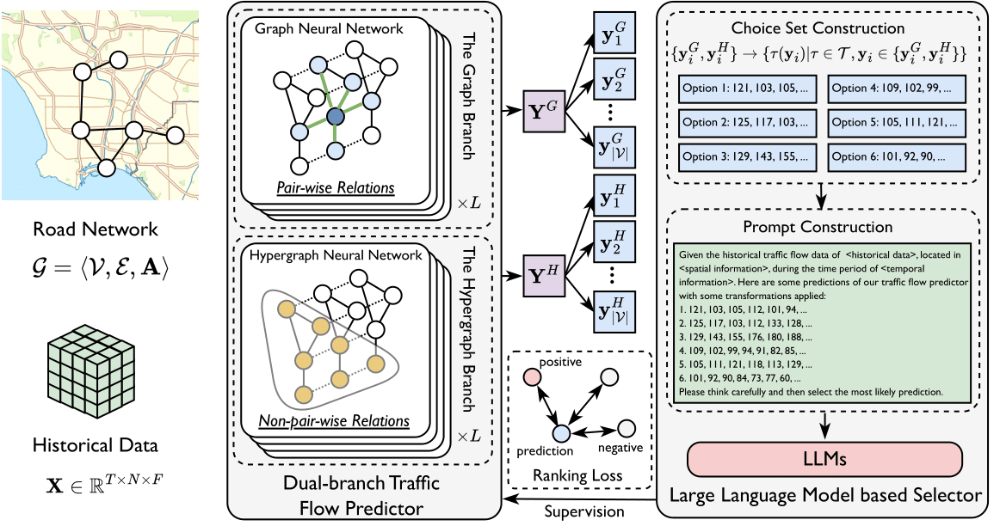

# Code for paper "Embracing Large Language Models in Traffic Flow Forecasting" accepted by ACL 2025 as Findings

## TL;DR

In this paper, we propose a novel framework named Large Language Model Enhanced Traffic Flow Predictor (LEAF) that leverages the discriminative ability of LLMs to enhance traffic flow forecasting.

## Abstract

Traffic flow forecasting aims to predict future traffic flows based on the historical traffic conditions and the road network. It is an important problem in intelligent transportation systems, with a plethora of methods been proposed. Existing efforts mainly focus on capturing and utilizing spatio-temporal dependencies to predict future traffic flows. Though promising, they fall short in adapting to test-time environmental changes of traffic conditions. To tackle this challenge, we propose to introduce large language models (LLMs) to help traffic flow forecasting and design a novel method named Large Language Model Enhanced Traffic Flow Predictor (LEAF). LEAF adopts two branches, capturing different spatio-temporal relations using graph and hypergraph structures respectively. The two branches are first pre-trained individually, and during test-time, they yield different predictions. Based on these predictions, a large language model is used to select the most likely result. Then, a ranking loss is applied as the learning objective to enhance the prediction ability of the two branches. Extensive experiments on several datasets demonstrate the effectiveness of the proposed LEAF.

## Framework



The framework of the proposed LEAF. LEAF consists of a dual-branch traffic flow predictor and a large language model based selector. The predictor generates forecasts of future traffic flows through the graph branch and the hypergraph branch. The selector constructs choice set and then selects the best option using LLMs. The results of selection is used to supervise the predictor.

## Software Requirements

* python 3.10
* pandas 1.5
* numpy 1.23
* pytorch 1.12
* tqdm 4.66
* loguru 0.6
* vllm 0.6
* transformers 4.45


## Data Sources

We use the PEMS dataset, which is provided by California Transportation Agencies (CalTrans) Performance Measurement Systems https://pems.dot.ca.gov/. The data is easy to obtain from published papers about traffic flow forecasting. As the files are large, we do not include them in this repo.

## Running Instructions

STEP 1: Pretrain the dual-branch predictor:

For the graph branch, run the following command:

```
python main.py --dataset <the name of the dataset> --expid <experiment id or tag> --model_name GraphBranch --epochs 200 --batch_size 32 --learning_rate 0.001
```

For the hypergraph branch, run the following command:

```
python main.py --dataset <the name of the dataset> --expid <experiment id or tag> --model_name HypergraphBranch --epochs 200 --batch_size 32 --learning_rate 0.001
```

STEP 2: Run the predict-select-supervise framework:

```
python main.py --dataset <the name of the dataset> --method select --expid <experiment id or tag> --model_list GraphBranch HypergraphBranch --adapter_type aug --selector_type llm --update_iters 5 --ckpt_paths <path to the graph branch checkpoint> <path to the hypergraph branch checkpoint>
```
